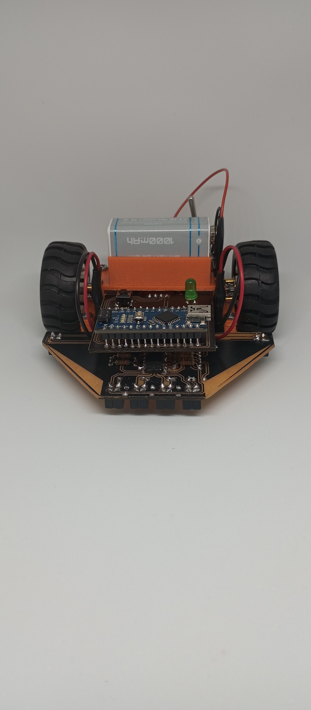

# 🤖 Robot Seguidor de Líneas Negras

Un sistema de control inteligente para robots seguidores de líneas con calibración en tres pasos y detección de ausencia de superficie.


## 📋 Características

- ✅ **Calibración en tres pasos**: Fondo blanco → Línea negra → Activación
- ✅ **Adaptación automática** a distintos tipos de sensores
- ✅ **Control PID** para seguimiento suave y preciso
- ✅ **Detección inteligente** de pérdida de línea
- ✅ **Protección contra caídas** mediante detección de ausencia de superficie
- ✅ **Feedback visual** mediante LED de estado
- ✅ **Información detallada** a través del monitor serie

## 🖼️ Vista previa



## 🛠️ Hardware Necesario

- Arduino NANO o compatible
- 6 sensores infrarrojos CNY70 (4 frontales + 2 laterales)
- 2 motores DC con reductor 
- 1 LED indicador
- 1 pulsador
- 1 LM324
- 1 LM358
- 2 2SD882 (Equivalentes: BD140/BD139/BD137/BD135 o 2N2222)
- Batería 9V 

### 📌 Conexiones

| Componente | Pin Arduino |
|------------|-------------|
| Sensor Izquierda Extrema | A2 |
| Sensor Izquierda Media | A1 |
| Sensor Derecha Media | A3 |
| Sensor Derecha Extrema | A4 |
| Sensor Lateral Izquierdo | A0 |
| Sensor Lateral Derecho | A5 |
| Pulsador | D12 |
| LED Indicador | D11 |
| Motor Derecho | D10 |
| Motor Izquierdo | D9 |

## 🚀 Instalación

1. Clona este repositorio:
```bash
git clone https://github.com/gustavofernandez/robot-seguidor-lineas.git
```

2. Abre el archivo `Robot.ino` en el Arduino IDE

3. Conecta tu Arduino y selecciona el puerto correcto

4. Sube el sketch a tu Arduino

## 📖 Guía de Uso

### Proceso de Calibración

El robot requiere una calibración de 3 pasos antes de comenzar a funcionar:

1. **Primera pulsación** - Calibra fondo blanco:
   - Coloca el robot sobre una superficie blanca
   - Presiona el pulsador
   - El LED cambiará su patrón de parpadeo a velocidad media

2. **Segunda pulsación** - Calibra línea negra:
   - Coloca el robot sobre una línea negra
   - Presiona el pulsador
   - El LED cambiará su patrón de parpadeo a velocidad rápida

3. **Tercera pulsación** - Activa el seguimiento:
   - Coloca el robot en posición para seguir la línea
   - Presiona el pulsador
   - El robot comenzará a seguir la línea negra

### Monitor Serie

Para ver información detallada durante la calibración y operación:

1. Abre el monitor serie en Arduino IDE a 9600 bauds
2. Durante la calibración verás los valores leídos para cada sensor
3. Durante la operación verás actualizaciones periódicas del estado de los sensores

## ⚙️ Ajuste de Parámetros

El código está diseñado para ser fácilmente ajustable. Principales parámetros:

```arduino
// Parámetros PID
float Kp = 35.0;          // Aumentar para respuesta más agresiva a desviaciones
float Kd = 15.0;          // Aumentar para reducir oscilaciones

// Velocidades
int BASE_SPEED = 150;     // Velocidad normal de avance
int MAX_SPEED = 200;      // Velocidad máxima en curvas
```

## 📚 Detalles Técnicos

### Control PID

El sistema utiliza un controlador PD (Proporcional-Derivativo) para ajustar la velocidad de los motores:

- **Componente P**: Responde a la desviación actual
- **Componente D**: Reduce oscilaciones y suaviza el movimiento

### Detección de Superficie

El sistema detecta automáticamente cuando el robot no está sobre ninguna superficie utilizando:

- Comparación de lecturas con valores calibrados
- Detección independiente por cada sensor

## 📄 Licencia

Este proyecto está licenciado bajo [MIT License](LICENSE) - ver el archivo LICENSE para más detalles.

## 📞 Contacto

[Gustavo Fernández] - [gustavoo.fernandez@gmail.com]

Link del proyecto: [https://github.com/gustavofernandez/Robot-seguidor-de-linea](https://github.com/gustavofernandez/Robot-seguidor-de-linea)

---

